## section schema协议解析

每个section片段都有自己的schema，用于描述组件的配置项，这个用于在编辑器中渲染section片段的配置项。

section用于片段渲染，定义在sections/目录下

```js
const schemaJson = {
  name: 't:sections.multi-media-splicing.name',
  icon: 'video',
  max_blocks: 3,
  class: 'section',
  blocks: [
    {
      type: 'video',
      icon: 'normal',
      name: 't:sections.multi-media-splicing.blocks.video.name',
      settings: [
        {
          id: 'cover_image',
          type: 'image_picker',
          label: 't:sections.multi-media-splicing.blocks.video.settings.cover_image.label',
        },
        {
          type: 'video_url',
          id: 'external_video',
          format: 'video',
          label: 't:sections.multi-media-splicing.blocks.video.settings.external_video.label',
          placeholder: 'https://www.youtube.com/watch?v=V7BEzkRBp_g',
          info: 't:sections.multi-media-splicing.blocks.video.settings.external_video.info',
        },
      ],
    },
    {
      type: 'product',
      icon: 'normal',
      name: 't:sections.multi-media-splicing.blocks.product.name',
      settings: [
        {
          type: 'product_picker',
          id: 'product',
          label: 't:sections.multi-media-splicing.blocks.product.settings.product.label',
        },
      ],
    },
    {
      type: 'collection',
      icon: 'normal',
      name: 't:sections.multi-media-splicing.blocks.collection.name',
      settings: [
        {
          type: 'collection_picker',
          id: 'category',
          label: 't:sections.multi-media-splicing.blocks.collection.settings.category.label',
        },
      ],
    },
    {
      type: 'image',
      icon: 'normal',
      name: 't:sections.multi-media-splicing.blocks.image.name',
      settings: [
        {
          type: 'image_picker',
          id: 'image',
          label: 't:sections.multi-media-splicing.blocks.image.settings.image.label',
        },
      ],
    },
  ],
  settings: [
    {
      type: 'text',
      id: 'title',
      label: 't:sections.multi-media-splicing.settings.title.label',
    },
    {
      type: 'group_header',
      label: 't:sections.multi-media-splicing.settings.group_header__0.label',
    },
    {
      type: 'range',
      id: 'padding_top',
      label: 't:sections.multi-media-splicing.settings.padding_top.label',
      default: 80,
      min: 0,
      max: 100,
      step: 2,
      unit: 'px',
    },
  ],
  presets: [
    {
      category_index: 1,
      category: 't:sections.multi-media-splicing.presets.presets__0.category',
      name: 't:sections.multi-media-splicing.presets.presets__0.name',
      blocks: [
        {
          type: 'video',
          settings: {
            cover_image: '',
            internal_video: '',
            external_video: '',
            video_alt: 'Describe the video',
            image_padding: 'cover',
          },
        },
        {
          type: 'product',
          settings: {
            product: null,
            product_hover_show_next: false,
            image_padding: 'cover',
          },
        },
        {
          type: 'collection',
          settings: {
            category: '',
            image_padding: 'cover',
          },
        },
      ],
      settings: {
        title_size: 'title3',
        desktop_layout: 'left',
        mobile_layout: 'splicing',
        color_scheme: 'none',
        padding_top: 80,
        padding_bottom: 80,
      },
    },
  ],
};
```

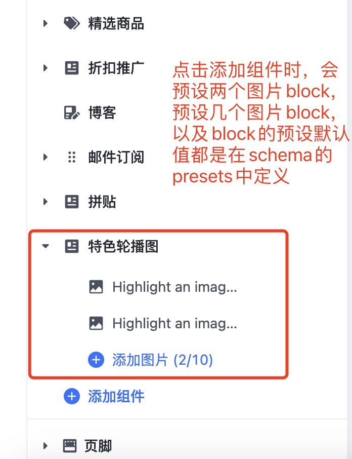

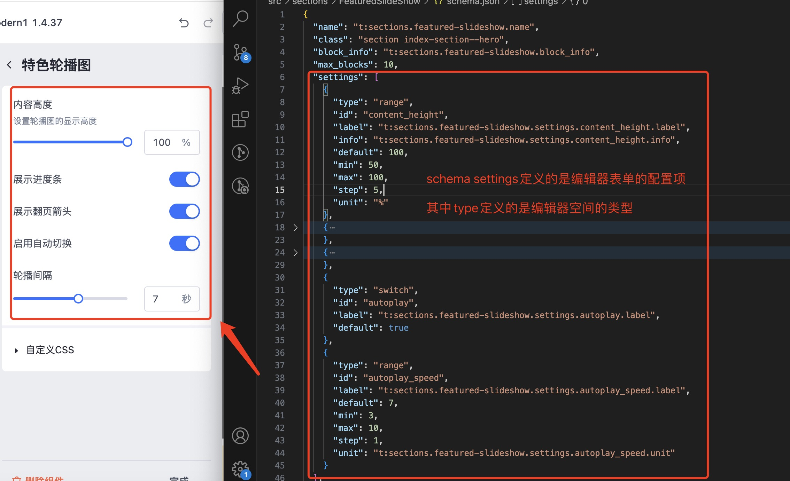

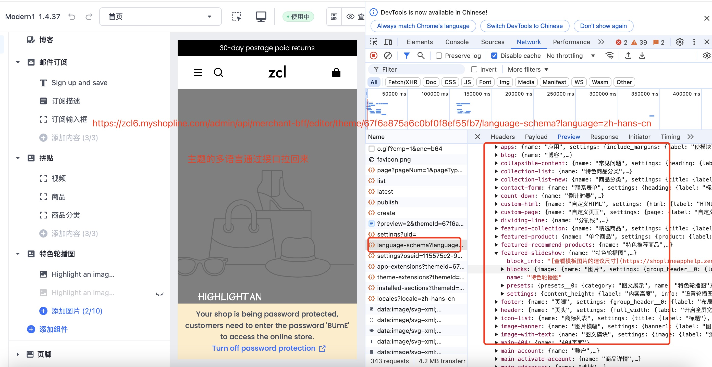

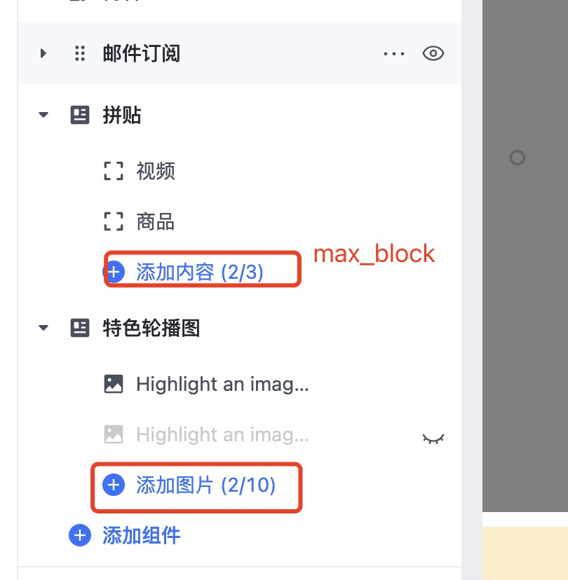

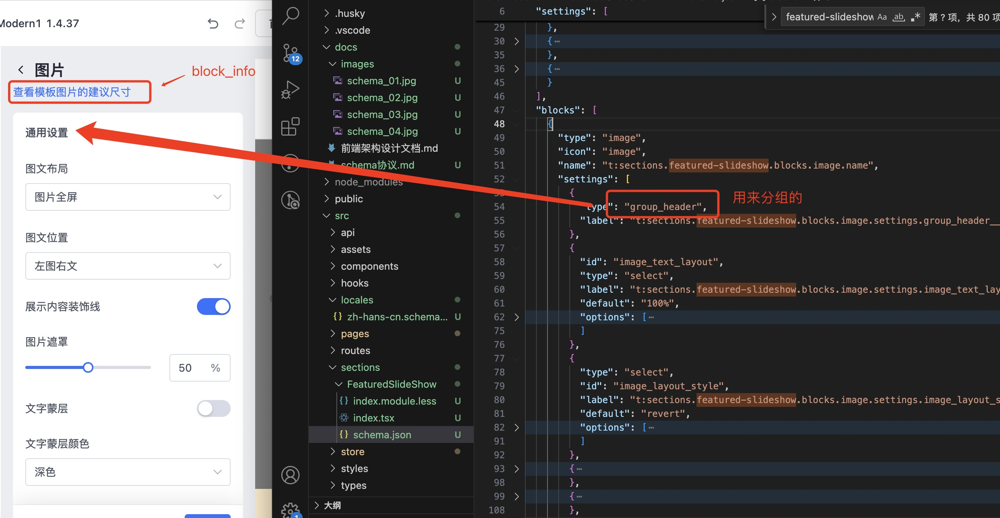

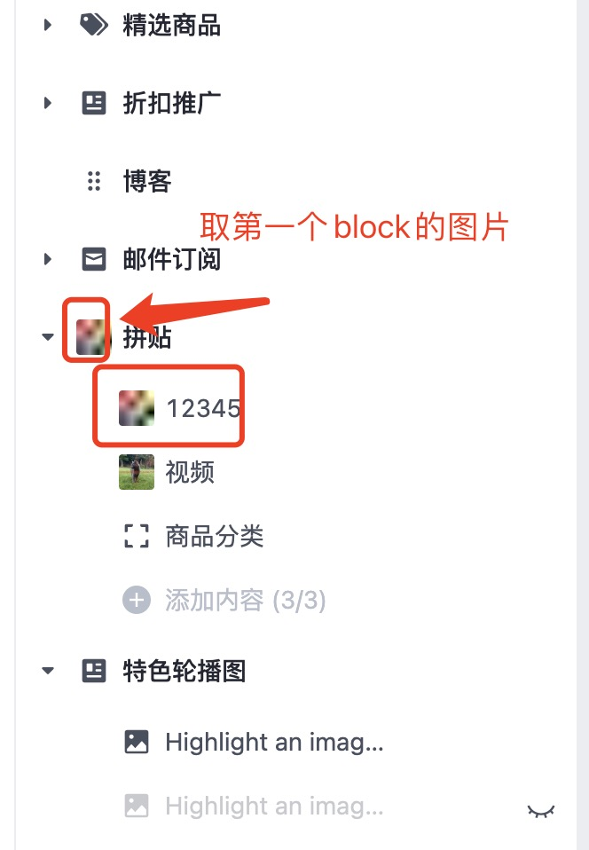

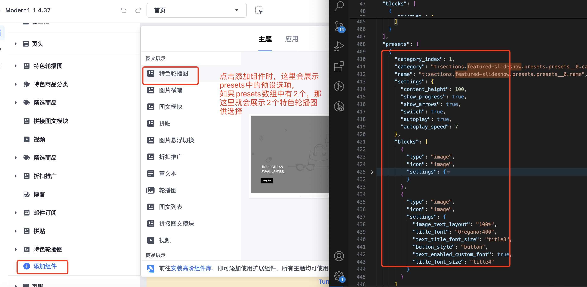

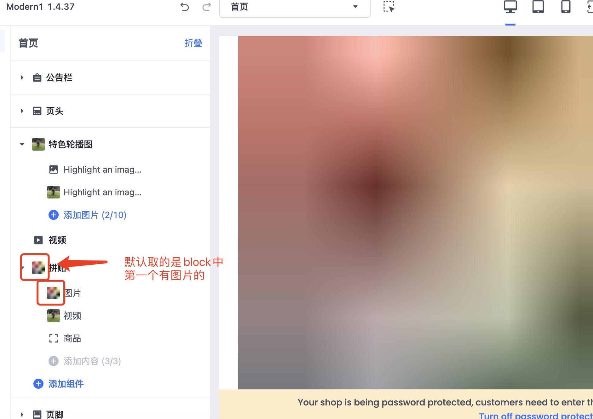

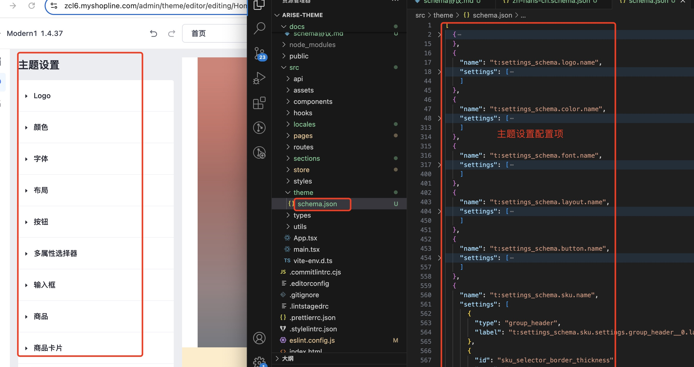

## section默认值

在编辑器添加组件时，会先从presets取，如果presets没有对应的配置项的预设值，则从settings或者block.settings里去该配置项的默认值。

## theme schema协议解析

theme schema主要用于全局定制，比如字体，logo等，定义在src/theme目录下。

## 多语言

主题的多语言分为两部分，一部分是配置项的多语言，格式为src/locales/zh-hans-cn.schema.json，用于在编辑器中显示对应语言的文案。一部分是主题预览的多语言，格式为src/locales/zh-hans-cn.json

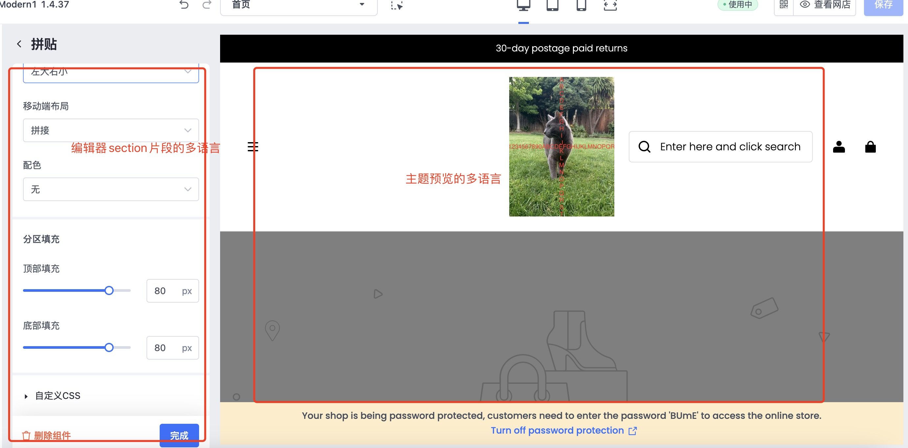

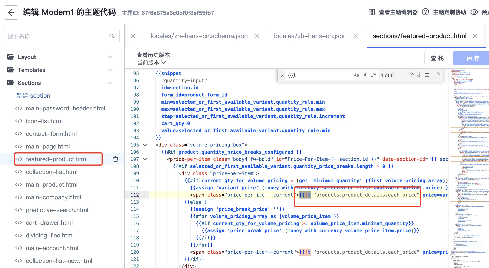

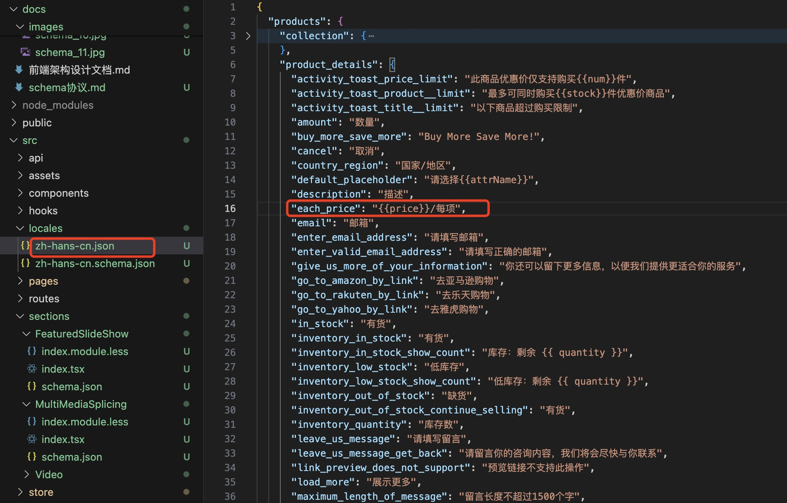

## 编辑器逻辑
